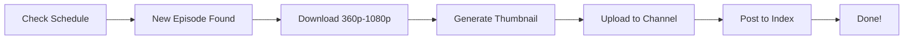

# 🤖 AutoAnimeBot - Recreated 2025

> **Fully automated Telegram bot for anime channels**  
> Downloads episodes, generates thumbnails, and uploads to your channels automatically.

[](https://python.org)
[](https://docs.pyrogram.org)
[](LICENSE)

---

## ✨ Features

### 🎬 Fully Automated
- Monitors airing anime schedules
- Downloads new episodes automatically
- Uploads in multiple qualities (360p - 1080p)
- Posts to index and uploads channels

### 🎨 Visual Features
- Auto-generates custom thumbnails
- Episode preview backgrounds
- Channel branding on every video

### 💪 Robust & Reliable
- Retry logic for failed downloads
- Queue system for smooth processing
- Error recovery and logging
- MongoDB database for tracking

### 🌐 Modern Tech Stack
- **Pyrogram 2.0** - Latest Telegram client
- **AniList API** - Reliable anime data
- **Consumet API** - Multiple anime sources
- **MongoDB** - Cloud database
- **Async/Await** - High performance

---

## 📁 Project Structure

```
AutoAnimeBot/
├── main.py              # Main bot entry point
├── config.py            # Configuration handler
├── database.py          # MongoDB operations
├── scheduler.py         # Episode checker
├── downloader.py        # Episode downloader
├── uploader.py          # Telegram uploader
├── requirements.txt     # Dependencies
├── .env.sample         # Environment template
├── .env                # Your config (create this)
├── SETUP_GUIDE.md      # Detailed setup guide
├── README.md           # This file
├── downloads/          # Downloaded episodes (auto-created)
├── thumbnails/         # Generated thumbnails (auto-created)
└── bot.log            # Log file (auto-created)
```

---

## 🚀 Quick Start

### 1. Clone/Download Files
Create a folder and place all the Python files in it.

### 2. Install Requirements
```bash
python3 -m venv venv
source venv/bin/activate
pip install -r requirements.txt
```

### 3. Configure
```bash
cp .env.sample .env
# Edit .env with your values
```

### 4. Run
```bash
python main.py
```

**📖 For detailed setup instructions, see [SETUP_GUIDE.md](SETUP_GUIDE.md)**

---

## 📋 Requirements

### Before Starting
- Python 3.11 or higher
- Telegram account
- MongoDB Atlas account (free)
- 2 Telegram channels (Index + Uploads)
- 1 Telegram group (Comments)

### Environment Variables
All configuration is done through `.env` file:
- Telegram API credentials
- Bot token
- Channel IDs
- MongoDB connection
- Feature toggles

See `.env.sample` for full list.

---

## 🎮 Bot Commands

### User Commands
- `/start` - Welcome message
- `/status` - Check bot status
- `/stats` - View statistics
- `/add [anime_name]` - Add anime to track
- `/list` - Show tracked anime
- `/remove [anime_id]` - Stop tracking
- `/help` - Show help

### Admin Commands (only for configured admin IDs)
- `/logs` - Get bot log file

---

## 🎯 How It Works



1. **Scheduler** checks AniList every 5 minutes for new episodes
2. **Downloader** fetches episodes from Consumet in all qualities
3. **Uploader** generates thumbnails and uploads to Telegram
4. **Index Post** shares links and info on index channel
5. **Queue System** manages everything smoothly

---

## 🆓 Free Hosting

The bot works perfectly on free hosting:

### Option 1: Railway.app ⭐ Recommended
- $5 free credit per month
- Easy GitHub deployment
- 500MB RAM + 1GB disk
- Perfect for small-medium bots

### Option 2: Render.com
- Free tier available
- Sleeps after 15min inactivity
- Good for testing

### Option 3: Fly.io
- 3 shared VMs free
- 160GB bandwidth/month
- More technical but powerful

### Option 4: Your Own VPS
- DigitalOcean: $6/month
- Hetzner: €4/month
- Oracle Cloud: Free tier available

**📖 Deployment guides in [SETUP_GUIDE.md](SETUP_GUIDE.md)**

---

## ⚙️ Configuration

### Quality Settings
Control which video qualities to download:
```env
DOWNLOAD_QUALITIES=360p,480p,720p,1080p
```

### Timing Controls
```env
CHECK_INTERVAL=300        # Check every 5 minutes
UPLOAD_SLEEP_TIME=5       # Wait 5s between uploads
DOWNLOAD_TIMEOUT=3600     # 1 hour timeout
```

### Feature Toggles
```env
ENABLE_THUMBNAILS=True    # Generate thumbnails
AUTO_DETECT=True          # Auto episode detection
ENABLE_VOTING=True        # Voting buttons
DELETE_AFTER_UPLOAD=True  # Save disk space
```

---

## 📊 Statistics

The bot tracks:
- Total anime being tracked
- Episodes downloaded
- Episodes uploaded
- Queue status
- Success rates

View with `/stats` command or check MongoDB directly.

---

## 🐛 Troubleshooting

### Common Issues

**Bot won't start**
```bash
# Check configuration
python config.py

# Verify environment
cat .env
```

**Can't connect to database**
- Check MongoDB connection string
- Verify IP whitelist in MongoDB Atlas
- Test connection: `python -c "from motor.motor_asyncio import AsyncIOMotorClient; print('OK')"`

**Download fails**
- Try different Consumet API instance
- Check internet connection
- Verify anime name is correct

**Upload errors**
- Ensure bot is admin in channels
- Check file size under 2GB
- Increase `UPLOAD_SLEEP_TIME`

**View Logs**
```bash
tail -f bot.log
```

---

## 🔒 Security Notes

### Keep Private
Never share your:
- `API_HASH` and `API_ID`
- `BOT_TOKEN`
- `MONGO_URI`
- `.env` file

### Best Practices
- Use strong MongoDB passwords
- Restrict admin IDs to trusted users only
- Keep bot token secure
- Don't commit `.env` to Git

---

## 📜 License

This project is licensed under the MIT License.

### Terms
- ✅ Free to use and modify
- ✅ Can create your own instances
- ❌ Cannot sell this bot
- ❌ Must credit original author

---

## ⚠️ Legal Disclaimer

**Important:** This bot is for educational purposes. 

- Hosting copyrighted content may be illegal in your jurisdiction
- Use only for personal use or licensed content
- Respect copyright laws
- Consider legal alternatives

The authors are not responsible for misuse.

---

## 🙏 Credits

### Original Project
- [TechShreyash/AutoAnimeBot](https://github.com/TechShreyash/AutoAnimeBot) (archived)
- Recreated and modernized for 2025

### APIs & Services
- [AniList](https://anilist.co) - Anime database
- [Consumet](https://github.com/consumet) - Anime sources
- [Pyrogram](https://pyrogram.org) - Telegram client
- [MongoDB](https://mongodb.com) - Database

### Community
Thanks to everyone who contributed ideas and testing!

---

## 🤝 Contributing

While this is a recreation, contributions are welcome:

1. Fork the repository
2. Create a feature branch
3. Make your changes
4. Test thoroughly
5. Submit a pull request

### Areas for Improvement
- [ ] Better error handling
- [ ] More anime sources
- [ ] Web dashboard
- [ ] Multi-language support
- [ ] Better thumbnail generation
- [ ] Batch operations

---

## 📞 Support

### Need Help?
1. Check [SETUP_GUIDE.md](SETUP_GUIDE.md) first
2. Read troubleshooting section above
3. Check `bot.log` for errors
4. Verify all environment variables

### Found a Bug?
Please provide:
- Error message from logs
- Steps to reproduce
- Your environment (.env values hidden)
- Expected vs actual behavior

---

## 🎯 Roadmap

### Planned Features
- [ ] Web interface for management
- [ ] More anime sources integration
- [ ] Batch download mode
- [ ] Custom thumbnail templates
- [ ] Subtitle support
- [ ] Quality selection per anime
- [ ] Scheduled posting
- [ ] Analytics dashboard

---

## ⭐ Star History

If this project helped you, consider giving it a star!

---

## 📝 Changelog

### Version 2.0 (2025)
- Complete rewrite with modern tech
- Pyrogram 2.0 support
- AniList + Consumet APIs
- Improved error handling
- Better documentation
- Free hosting options

### Version 1.0 (2023)
- Original release by TechShreyash
- GogoAnime + TechZApi
- Heroku deployment

---

**Made with ❤️ for the anime community**

*Automate your anime channel and focus on enjoying the content!* 🎉
